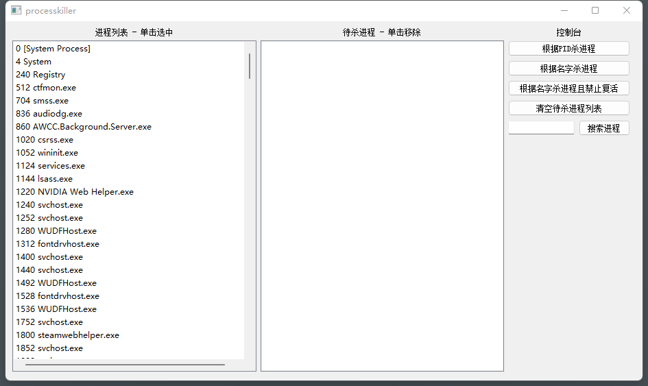
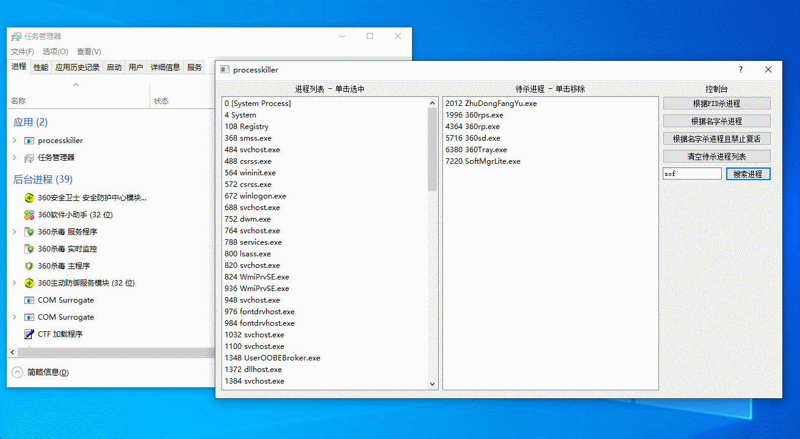

# processkiller

## 警告

使用该软件前，应做好备份工作，避免数据丢失。强杀某些进程可能导致蓝屏，请自行评估风险，使用该软件造成的任何后果由使用者自行承担。

## 简介

强杀进程工具，兼容 WIN7 及以上版本64位 Windows 系统。目前在 WIN7, WIN10, WIN11 的机器上测试均能正常使用。

## 驱动加载失败解决方法

如果出现驱动加载失败，请使用管理员运行；如果驱动被杀毒软件拦截，请到隔离区恢复到原路径；如果不是以上问题，则可能是签名失效，可以给 ProcessKiller.sys 重新打签名。

## 效果图

